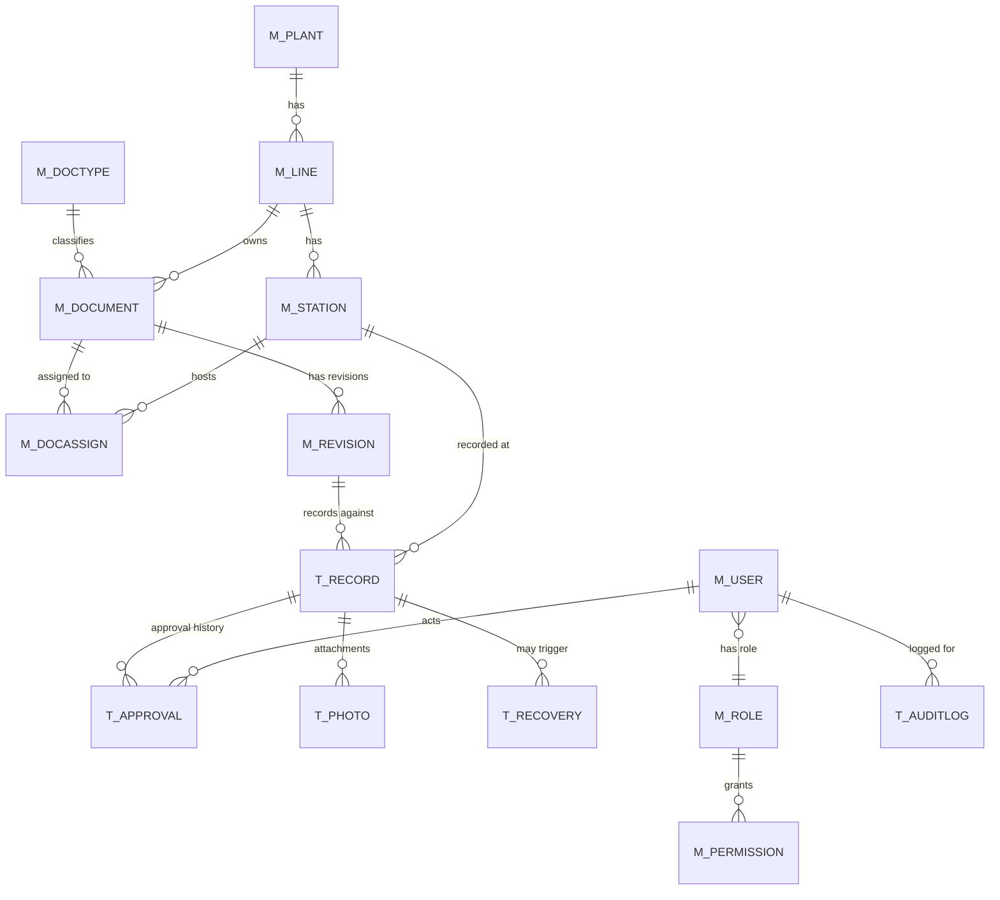
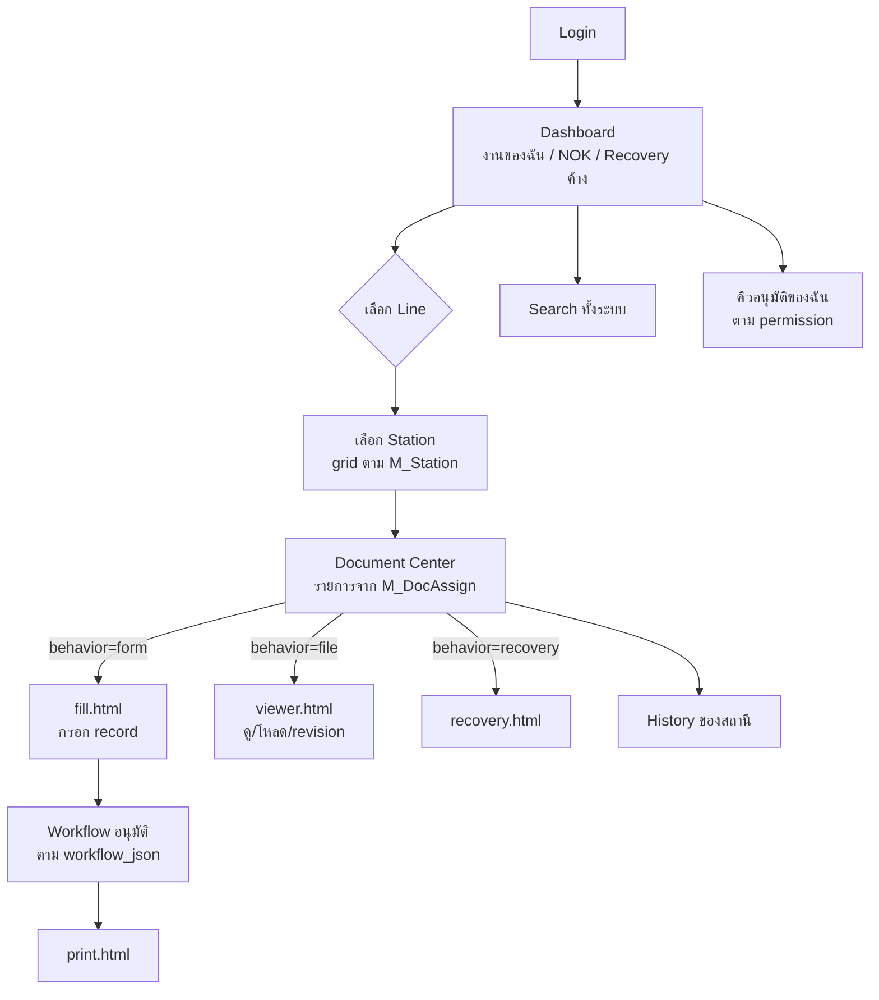
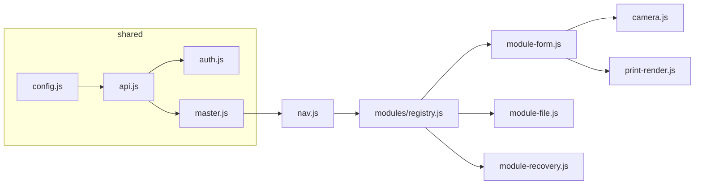

# ENC Manufacturing Quality Management System — Architecture Proposal

> เอกสารออกแบบสถาปัตยกรรมใหม่ สำหรับขยายระบบจาก "Digital Form (First Piece)"
> ไปเป็น **ระบบกลางบริหารเอกสารคุณภาพของไลน์ ENC (H9)**
> สถานะ: **DRAFT — รอ review** | ยังไม่มีการแก้โค้ดใดๆ ตามเอกสารนี้

---

# Phase 1 — Review ระบบปัจจุบัน

## 1.1 Architecture ปัจจุบัน

```
GitHub Pages (static)                    Google Apps Script          Google
┌─────────────────────────────┐          ┌──────────────────┐        ┌────────────┐
│ index.html  → เลือกฟอร์ม     │  fetch   │ doGet/doPost      │        │ Sheets      │
│ fill.html   → form-render.js │ ───────► │  action router    │ ─────► │  Records    │
│ records.html→ ค้นหา/อนุมัติ   │  JSON    │  (9 actions)      │        │  Recovery   │
│ print.html  → print-render.js│          │                   │ ─────► │  Users      │
│ templates/*.json (นิยามฟอร์ม) │          │                   │        │  Config     │
└─────────────────────────────┘          └──────────────────┘        │ Drive       │
                                                                      │  {line}/{ym}│
                                                                      └────────────┘
```

การไหลของข้อมูล: `Login → เลือก Form (CONFIG.FORMS) → โหลด template JSON → กรอก →
createRecord → อนุมัติตามสถานะ → Print`

**ทุกอย่างหมุนรอบ `form_id`** — ฟอร์มคือแกนของระบบ, Line/Station เป็นแค่ field
ประกอบใน record

## 1.2 จุดแข็ง (สิ่งที่ต้องรักษาไว้)

| จุดแข็ง | รายละเอียด | ผลต่อ architecture ใหม่ |
|---|---|---|
| **Template-driven form engine** | `form-render.js`/`print-render.js` ไม่ hardcode รายการตรวจ อ่านจาก JSON ทั้งหมด | เก็บไว้ทั้ง engine — กลายเป็น "Form Module" หนึ่งใน module registry |
| **Zero build step** | Vanilla JS, ไม่มี dependency, deploy = push | เก็บไว้ — สำคัญมากกับการดูแลระยะยาวในโรงงาน |
| **Print fidelity แยกต่อฟอร์ม** | print CSS ต่อฟอร์ม ชี้จาก field `print_css` ใน template | เก็บไว้ — pattern นี้ขยายเป็น per-document ได้เลย |
| **Draft ใน localStorage** | network หลุดข้อมูลไม่หาย | เก็บไว้ — เป็นฐานของ Offline mode ในอนาคต |
| **CORS text/plain pattern** | เลี่ยง preflight ที่ GAS ไม่รองรับ | เก็บไว้ |
| **Batch Sheet I/O + LockService** | ไม่ loop ทีละเซลล์, กัน race ตอน gen ID | เก็บไว้ |
| **PIN hash + token auth** | ไม่มี PIN ดิบในชีท | เก็บไว้ ต่อยอดเป็น permission แบบ dynamic |

## 1.3 จุดอ่อน — และจะพังตรงไหนเมื่อโต

### (ก) Form list hardcode ในโค้ด
`js/config.js` → `CONFIG.FORMS = [...]` — เพิ่มเอกสาร 1 ใบ = แก้โค้ด + push ทุกครั้ง
**ที่ 300–700 เอกสาร**: ไม่ practical, ไฟล์ config บวมจนดูแลไม่ได้

### (ข) ไม่มี Master Data เลย
- Line/Station ฝังอยู่ *ใน* template JSON (`"stations": [2,3,...]`, `"lines": ["NMS"]`)
- ไม่มีที่เดียวที่ตอบได้ว่า "โรงงานมีไลน์อะไร แต่ละไลน์มีสถานีอะไร สถานีนี้มีเอกสารอะไร"
**ปัญหา**: หน้า Document Center ต่อสถานีสร้างไม่ได้ เพราะไม่มีข้อมูลว่า
Station 12 ของ Line4 มีเอกสารอะไรบ้าง

### (ค) Workflow hardcode 2 ชั้น
1. **ใน schema**: ชีท Records มีคอลัมน์ `operator_*/leader_*/qi_*` ตายตัว 9 คอลัมน์
   — เพิ่ม role ใหม่ (เช่น QA ต้อง approve ก่อน QI) = แก้ schema + โค้ดทุกจุด
2. **ในโค้ด**: `actionApproveRecord` เขียน if/else ตามสถานะ `PENDING_LEADER → PENDING_QI`
   และ `requireRole(user, ['Leader','QI'])` — ตรงกับสิ่งที่คุณบอกว่าห้ามทำ (`if(role=="Leader")`)

### (ง) ไม่มี Document / Revision เป็น entity
- Revision จัดการด้วย *ชื่อไฟล์* template (`nms-first-piece-rev1.json`) — ไม่มี
  effective date, ไม่มี approved by, ไม่มีสถานะ Current/Obsolete, ย้อนดูของเก่าไม่ได้อย่างเป็นระบบ
- เอกสารประเภท "ไฟล์" (WI, Drawing, Spec) ไม่มีที่อยู่ในระบบเลย

### (จ) Drive structure ไม่ตรงกับโครงสร้างโรงงาน
ปัจจุบัน `{root}/{line}/{YYYY-MM}/` (จัดตามเวลา) — พอต้องเก็บ WI/Drawing ต่อสถานี
โครงสร้างนี้ตอบไม่ได้ว่า "ไฟล์ทั้งหมดของ Station 12 อยู่ไหน"

### (ฉ) Scalability ของ Google Sheets
- ทุก action อ่าน**ทั้งชีท** (`getDataRange().getValues()`) แม้แต่ validateToken
  — ที่ 50,000 record การ login จะช้าเป็นวินาที
- ชีท Records เดียวรับ transaction ทุกประเภท — Sheets มีเพดาน ~10M เซลล์
  และช้าลงชัดเจนหลัง ~30–50k แถว
- **การประเมิน**: 37 สถานี × log-sheet วันละหลาย entry → หลักหมื่น record/ปี
  → ต้องมีแผนแบ่งชีท/archive ตั้งแต่ออกแบบ

### (ช) ไม่มี Audit Trail
`updated_at` ทับค่าเดิม — ไม่รู้ว่าใครแก้อะไร ค่าเดิมเป็นอะไร

### (ซ) Search ทำไม่ได้ข้าม entity
ค้น "Busbar" ปัจจุบันได้แค่ filter record ตาม product_model — ค้นเนื้อหาใน
template/WI/Drawing/Recovery ข้ามไลน์ไม่ได้

### สรุป Phase 1
> ระบบปัจจุบันคือ **form engine ที่ดี** แต่ไม่มี **ชั้นข้อมูลองค์กร** (Master Data)
> อยู่ข้างใต้ — สิ่งที่ต้องทำไม่ใช่รื้อ engine แต่คือ **สร้างชั้น Master Data + Document
> Registry ครอบลงไป** แล้วให้ form engine เดิมกลายเป็น module หนึ่งที่ถูกเรียกจากชั้นนั้น

---

# Phase 2 — Architecture ใหม่

## 2.0 หลักการออกแบบ

1. **Data-driven**: โครงสร้างโรงงาน/เอกสาร/สิทธิ์/workflow อ่านจาก Master Sheets ทั้งหมด
   — เพิ่มไลน์/สถานี/เอกสาร/role = เพิ่มแถวในชีท ไม่แตะโค้ด
2. **Document เป็น first-class entity**: ทุกอย่าง (ฟอร์ม, WI, Drawing) คือ Document
   ที่มี Type, Revision, ที่อยู่ใน Line/Station — ฟอร์มเป็นแค่ Document ที่ "สร้าง Record ได้"
3. **Behavior-based module**: โค้ด frontend แยกตาม *พฤติกรรม* ของเอกสาร (form / file /
   recovery) ไม่ใช่ตามชื่อเอกสาร — เพิ่มเอกสารประเภทใหม่ที่พฤติกรรมเดิม = ไม่แตะโค้ด
4. **Workflow เป็นข้อมูล**: ลำดับอนุมัติเก็บเป็น JSON ใน Master, ประวัติอนุมัติเป็นแถว
   ใน transaction — ไม่มีคอลัมน์ role ตายตัว
5. **ทุก mutation ผ่านจุดเดียว + เขียน Audit Log เสมอ**
6. Stack เดิมทั้งหมด: GitHub Pages + GAS + Sheets + Drive + Sarabun

## 2.1 ภาพรวม

```
┌──────────────────────── GitHub Pages ────────────────────────┐
│  Shell (navigation)          Modules (ตาม behavior)           │
│  ┌──────────────┐            ┌────────────────────────────┐  │
│  │ dashboard    │            │ module-form.js   (กรอก/พิมพ์)│  │
│  │  → Line      │──เปิด doc─►│ module-file.js   (ดู/โหลด)  │  │
│  │  → Station   │            │ module-recovery.js          │  │
│  │  → DocCenter │            │ (อนาคต: module-audit ฯลฯ)   │  │
│  └──────────────┘            └────────────────────────────┘  │
│        ▲ master data (cache)        ▲ template JSON / record  │
└────────┼────────────────────────────┼────────────────────────┘
         │            GAS Web App (API Router)
         │  ┌─────────────────────────────────────────┐
         └──│ master.* / doc.* / record.* / approval.* │
            │ search.* / audit.* / auth.* / file.*     │
            └───────────┬─────────────────┬───────────┘
                        ▼                 ▼
            ┌──────────────────┐   ┌──────────────────┐
            │ Spreadsheet:      │   │ Spreadsheet:      │     Google Drive
            │ ENC-MASTER        │   │ ENC-TRANSACTIONS  │   ENC/Line/Station/
            │ (M_* ทุกชีท)      │   │ (T_* + archive/ปี)│   DocType/...
            └──────────────────┘   └──────────────────┘
```

## 2.2 ลำดับชั้นข้อมูล (ตามที่กำหนด)

```
Plant (ENC)
 └─ Line (Line1, Line4, Line5)
     └─ Station (37 สถานี)
         └─ Document (ผูกผ่านตาราง assignment — เอกสาร 1 ใบใช้ได้หลายสถานี)
             └─ Revision (Rev01..RevNN, มี Current/Obsolete)
                 └─ Record (เฉพาะเอกสารประเภท form)
```

**ข้อสังเกตสำคัญจากของจริง**: OK 1st Part ใช้ template เดียวกับ 18 สถานี —
ถ้าบังคับ Document สังกัด Station เดียวจะต้อง copy เอกสาร 18 ชุด ทุกครั้งที่แก้
Rev ต้องแก้ 18 ที่ ดังนั้นออกแบบเป็น:
- `M_Document` = นิยามเอกสาร (สังกัด Line หรือ Plant)
- `M_DocAssign` = ตารางจับคู่ Document ↔ Station (1 เอกสาร → หลายสถานีได้)

## 2.3 Database (Google Sheets) — แยก Master / Transaction

**2 spreadsheets** (+ archive):

| Spreadsheet | เก็บอะไร | เหตุผล |
|---|---|---|
| `ENC-MASTER` | M_* ทุกชีท | เปลี่ยนช้า อ่านบ่อย → cache ฝั่ง client ได้ทั้งก้อน |
| `ENC-TRANSACTIONS` | T_* ทุกชีท | โตเร็ว → แยกออกเพื่อไม่ให้กระทบ master, archive เป็นรายปีได้ (`ENC-TRANSACTIONS-2027`) |

GAS เปิดด้วย `SpreadsheetApp.openById()` — ID เก็บใน Script Properties

### Master Sheets

| ชีท | หน้าที่ |
|---|---|
| `M_Plant` | โรงงาน (เผื่อขยายพ้น ENC) |
| `M_Line` | ไลน์ผลิต |
| `M_Station` | สถานีต่อไลน์ |
| `M_DocType` | ประเภทเอกสาร + **behavior + workflow + prefix เลข record** |
| `M_Document` | ทะเบียนเอกสารทุกใบ |
| `M_DocAssign` | เอกสาร ↔ สถานี |
| `M_Revision` | ทุก revision ของทุกเอกสาร |
| `M_User` | ผู้ใช้ (แทน Users เดิม) |
| `M_Role` | role (dynamic — เพิ่มแถวได้) |
| `M_Permission` | role × action × scope |
| `M_ProductFamily` | รุ่นหลัก (NMS, NLC, LC, CU, ...) |
| `M_Model` | รุ่นย่อยต่อ family (หลักร้อยรุ่น — import ได้) |
| `M_Shift` | กะ |
| `Config` | key/value (drive root, ค่าระบบ) |

### Transaction Sheets

| ชีท | หน้าที่ |
|---|---|
| `T_Record` | บันทึกการตรวจ (header + answers_json) — **ไม่มีคอลัมน์ role ตายตัวแล้ว** |
| `T_Approval` | ประวัติการอนุมัติ **1 แถว = 1 การกระทำ** (submit/approve/reject) |
| `T_Recovery` | recovery record (ยกระดับเป็น module ของตัวเอง มีสถานะติดตาม) |
| `T_Photo` | ทะเบียนรูป/ไฟล์แนบ (แยกจาก record → ถามได้ว่า "รูปทั้งหมดของสถานีนี้") |
| `T_AuditLog` | ทุก mutation: ใคร/ทำอะไร/เมื่อไร/ค่าเดิม/ค่าใหม่/device |
| `T_Notification` | event queue สำหรับ notification ในอนาคต |
| `T_SearchIndex` | ดัชนีค้นหา denormalized (สร้าง/อัปเดตตอนเขียนข้อมูล) |

## 2.4 Document Type + Behavior (หัวใจของการไม่แก้โค้ด)

`M_DocType` แต่ละแถวประกาศ **behavior** ที่ frontend ใช้เลือก module:

| behavior | ความสามารถ | ตัวอย่าง DocType |
|---|---|---|
| `form` | กรอก record จาก template JSON, workflow อนุมัติ, print A4 | First Piece, OK 1st Part, Check Sheet, Inspection Record, Audit Form |
| `file` | ดู/preview/download ไฟล์จาก Drive, ดู revision history, print | WI, OWS, Drawing, Specification, Standard, NG Example, Photo Standard, Training Document |
| `recovery` | สร้าง/ติดตาม/แนบรูป/อนุมัติ recovery | Recovery |

- เพิ่ม "Training Document" ในอนาคต → เพิ่ม 1 แถวใน `M_DocType` (behavior=file) จบ
- เพิ่มเอกสารที่พฤติกรรมใหม่จริงๆ (เช่น e-signature pad) → ค่อยเขียน module ใหม่
  1 ไฟล์ ลงทะเบียนใน module registry — ไม่แตะ module อื่น

`M_DocType.workflow_json` ประกาศลำดับอนุมัติ เช่น:
```json
[{"step":1,"role":"Leader","label":"หัวหน้างานยืนยัน"},
 {"step":2,"role":"QI","label":"QI อนุมัติ"}]
```
- First Piece = 2 step (Leader→QI), OK 1st Part = 1 step (Leader), อนาคต 3-4 step ได้
  โดยแก้ JSON ในชีท — โค้ด approve อ่าน workflow แล้วเดินตาม step ปัจจุบัน+1 เท่านั้น
- สถานะ record = `DRAFT / IN_APPROVAL(step n/N) / COMPLETED / REJECTED` คำนวณจาก
  T_Approval ล่าสุด + workflow definition

## 2.5 Permission (dynamic)

`M_Permission`: 1 แถว = 1 สิทธิ์

```
role | action                  | scope_line | scope_doctype
-----|-------------------------|------------|---------------
Leader | record.approve.step   | *          | *
QI     | record.approve.step   | *          | first-piece
Operator | record.create       | LINE4      | *
DocControl | document.revise   | *          | *
Admin  | *                     | *          | *
```

- ฝั่ง GAS: `can(user, action, {line, doctype})` — จุดตรวจเดียว ใช้ทุก action
- ฝั่ง frontend: master data ส่ง permission ของ user มาด้วย → ใช้ ซ่อน/แสดงปุ่ม
  (UX เท่านั้น การบังคับจริงอยู่ที่ backend)
- เพิ่ม role ใหม่ (QA, PE, Document Control, Manager...) = เพิ่มแถวใน M_Role +
  M_Permission — **ไม่มี `if(role=="...")` ในโค้ดอีกต่อไป** ยกเว้น `Admin = *`

## 2.6 Revision Control

- `M_Revision`: 1 แถวต่อ revision ต่อเอกสาร — rev_no, effective_date, approved_by,
  approved_date, reason, status (`DRAFT/CURRENT/OBSOLETE`), พร้อม pointer ไปเนื้อหา:
  - behavior=form → ชื่อไฟล์ template JSON ใน repo (เช่น `templates/fp-line4-st12-rev03.json`)
  - behavior=file → Drive fileId ของ PDF/รูป
- กติกา: เอกสาร 1 ใบมี CURRENT ได้ 1 revision, ตั้ง revision ใหม่เป็น CURRENT →
  ตัวเก่ากลายเป็น OBSOLETE อัตโนมัติ (ไม่ลบ — ย้อนดูได้เสมอ)
- Record เก็บ `revision_id` ที่ใช้ตอนกรอก → พิมพ์ย้อนหลังได้ด้วย template ที่ถูกต้อง
  ของยุคนั้น แม้เอกสารจะขึ้น Rev ใหม่ไปแล้ว
- template JSON เก่าเก็บใน git ตลอด (append-only) — git = ที่เก็บเนื้อหา,
  M_Revision = ทะเบียนควบคุม

## 2.7 Google Drive structure ใหม่

```
ENC/
├── Line1/
│   ├── Station01/
│   │   ├── FirstPiece/          ← เอกสาร + Records/รูปแนบของสถานีนี้
│   │   │   └── Records/2026-07/
│   │   ├── WI/                  ← PDF ทุก revision (ไฟล์ระบุ rev ในชื่อ)
│   │   ├── Drawing/
│   │   ├── CheckSheet/
│   │   ├── Recovery/
│   │   └── NG/
│   └── Station02/ ...
├── Line4/  (Station01..21)
└── Line5/  (Station01..08)
```

- backend มี `ensureFolderPath(['ENC','Line4','Station12','WI'])` — สร้างให้อัตโนมัติ
  ถ้ายังไม่มี (generalize จาก `getPhotoFolder` เดิม)
- folder id ที่สร้างแล้ว cache ใน `M_Document.drive_folder_id` — ไม่ต้อง walk ทุกครั้ง
- เอกสารที่ใช้ร่วมหลายสถานี เก็บที่ระดับ Line (`Line4/_Shared/OK1stPart/`)
  แล้ว M_DocAssign ชี้เข้าไป — ไม่ copy ไฟล์

## 2.8 Navigation ใหม่ (Dashboard-first)

```
Login
 └─ Dashboard   (การ์ดสรุป: งานรออนุมัติของฉัน, NOK วันนี้, Recovery ค้าง, ทางลัดไลน์)
     └─ เลือก Line (Line1 / Line4 / Line5)
         └─ เลือก Station (grid ปุ่มใหญ่ตามจำนวนจริงของไลน์)
             └─ Document Center ของสถานี
                 ├─ First Piece   → module-form   (กรอกใหม่ / ดู record / พิมพ์)
                 ├─ OK 1st Part   → module-form
                 ├─ WI            → module-file   (ดู PDF / revision / พิมพ์)
                 ├─ Drawing       → module-file
                 ├─ Recovery      → module-recovery
                 ├─ History       → record ทั้งหมดของสถานี
                 └─ Revision      → ทะเบียน revision ของเอกสารในสถานี
```

- ทุกระดับ render จาก master data — ไม่มีรายการใด hardcode
- ค้นหา (global search) อยู่บน app bar ทุกหน้า
- หน้าเดิม (records.html, print.html) ยังอยู่ — ถูกเรียกจาก Document Center แทน

## 2.9 Search

- **T_SearchIndex**: 1 แถวต่อ searchable entity —
  `entity_type | entity_id | line | station | doctype | keywords | updated_at`
- keywords = ชื่อเอกสาร + รายการตรวจใน template + product_model + ข้อความใน
  recovery ฯลฯ (สร้างตอน save — ไม่ scan ตอนค้น)
- ค้น "Busbar" → GAS filter ชีท index ชีทเดียว → ผลลัพธ์ชี้กลับไปเอกสาร/record
  พร้อม deep-link เปิด module ที่ถูกต้อง
- แลกมาด้วยการเขียน index ตอน save เพิ่มเล็กน้อย — คุ้มกว่า full scan ทุกชีทตอนค้นมาก

## 2.10 Audit Trail

- ทุก action ที่เขียนข้อมูลจบด้วย `audit(user, action, entity, before, after, device)`
- ข้อจำกัดที่ต้องรู้: **GAS Web App ไม่เห็น IP address ของ client** (Google ไม่ส่งมาให้)
  — เก็บได้: user, timestamp, action, entity, ค่าก่อน/หลัง, device/user-agent
  (client ส่งมากับ request) ซึ่งครอบคลุมความต้องการ audit ภายในโรงงาน
- T_AuditLog เป็น append-only — ไม่มี action ไหนแก้/ลบแถวเดิม

## 2.11 Notification (เตรียมโครง ไม่ implement ตอนนี้)

- ทุก state change เขียน event ลง `T_Notification`
  (`event_type | target_role/user | payload | status=PENDING`)
- อนาคต: time-driven trigger ของ GAS (ทุก 5-15 นาที) อ่าน PENDING → ส่ง
  Email (MailApp) หรือ LINE Notify → ตั้ง SENT
- สิ่งที่ต้องทำ *ตอนนี้* มีแค่: เขียน event ลงคิวจากจุด state change — จุดส่งค่อยเติม

## 2.12 Offline (เตรียมโครง)

- ทุก record ที่ client สร้างมี `client_uuid` (สร้างฝั่ง client) →
  backend ใช้เป็น idempotency key: sync ซ้ำไม่เกิด record ซ้ำ
- draft/queue เก็บ localStorage เหมือนเดิม (ยกระดับเป็น IndexedDB เมื่อรูปเยอะ)
- โครงสร้างนี้ทำให้ "Sync เมื่อมี Internet" เป็นแค่การ replay queue — ไม่ต้องรื้อ schema

---

# Phase 3 — Schema / Diagram / โครงสร้าง

## 3.1 ER Diagram



## 3.2 Database Schema (คอลัมน์ต่อชีท)

### ENC-MASTER

```
M_Plant      : plant_id | plant_name | display_name | status
M_Line       : line_id | plant_id | line_name | display_name | sequence | status
M_Station    : station_id | line_id | station_no | station_name | sequence | status
M_DocType    : doctype_id | doctype_name | display_name_th | behavior(form|file|recovery)
             | workflow_json | record_prefix | icon | sequence | status
M_Document   : doc_id | doctype_id | family_id(*|family) | line_id(*|line) | doc_name
             | doc_no(เลขเอกสารควบคุม — อ่านจาก Master, ผู้สร้างกรอกได้ถ้าไม่มี)
             | current_rev_id | drive_folder_id | print_css | status
M_DocAssign  : assign_id | doc_id | station_id | status
M_Revision   : rev_id | doc_id | rev_no | content_ref(template path หรือ Drive fileId)
             | effective_date | approved_by | approved_date | reason
             | status(DRAFT|CURRENT|OBSOLETE) | created_at
M_User       : user_id | employee_id | name | pin | role_id | default_line_id
             | token | token_expiry | status
M_Role       : role_id | role_name | display_name_th | sequence | status
M_Permission : perm_id | role_id | action | scope_line(*|line_id) | scope_doctype(*|doctype_id)
M_ProductFamily : family_id | family_name | display_name | sequence | status
M_Model      : model_id | family_id | model_name | status
M_Shift      : shift_id | shift_name | time_range | status
Config       : key | value
```

### ENC-TRANSACTIONS

```
T_Record    : record_id | client_uuid | doc_id | rev_id | line_id | station_id
            | product_model | date | shift | answers_json | has_nok
            | current_step | status(DRAFT|IN_APPROVAL|COMPLETED|REJECTED)
            | created_by | created_at | updated_at
T_Approval  : approval_id | record_id | step_no | action(SUBMIT|APPROVE|REJECT)
            | role_id | user_id | user_name | comment | ts
T_Recovery  : recovery_id | record_id(nullable) | line_id | station_id | item_ref
            | problem | countermeasure | photos_json | status(OPEN|IN_PROGRESS|CLOSED)
            | due_date | created_by | created_at | closed_by | closed_at | decision
T_Photo     : photo_id | record_id | recovery_id | item_id | drive_file_id
            | file_name | uploaded_by | ts
T_AuditLog  : log_id | ts | user_id | user_name | action | entity_type | entity_id
            | before_json | after_json | device
T_Notification : event_id | ts | event_type | target_role | target_user
            | payload_json | status(PENDING|SENT|SKIPPED)
T_SearchIndex  : entity_type | entity_id | line_id | station_id | doctype_id
            | title | keywords | updated_at
```

- `record_id` ใหม่: `{record_prefix}-{LINE}-{ST}-{YYYYMMDD}-{seq}`
  เช่น `FP-L4-ST12-20260708-003` (prefix มาจาก M_DocType — data-driven)
- **ลายเซ็นไม่อยู่ใน T_Record แล้ว** — อ่านจาก T_Approval (ประวัติเต็ม ทุก step)

## 3.3 Folder Structure (repo)

```
├── index.html               # login + Dashboard
├── station.html             # เลือก Line → Station → Document Center
├── fill.html                # module-form: กรอก (engine เดิม)
├── records.html             # ค้นหา record + คิวอนุมัติ (เดิม ปรับ filter ตาม master)
├── viewer.html              # module-file: ดู WI/Drawing + revision history
├── recovery.html            # module-recovery
├── print.html               # print view (เดิม)
├── search.html              # global search
├── css/
│   ├── app.css
│   └── print/               # print CSS ต่อเอกสาร (ชี้จาก M_Document.print_css)
├── js/
│   ├── config.js            # เหลือแค่ GAS_URL + ค่าคงที่ระบบ (ไม่มี FORMS list แล้ว)
│   ├── api.js               # wrapper เดิม + action namespace ใหม่
│   ├── auth.js              # + permission check จาก master
│   ├── master.js            # โหลด/cache master data (localStorage + version stamp)
│   ├── nav.js               # Dashboard → Line → Station → DocCenter (data-driven)
│   ├── camera.js
│   ├── modules/
│   │   ├── registry.js      # behavior → module mapping
│   │   ├── module-form.js   # = form-render.js เดิม (ย้าย+ห่อ interface)
│   │   ├── module-file.js
│   │   └── module-recovery.js
│   └── print-render.js
├── templates/               # template JSON ทุก revision (append-only, ควบคุมด้วย git)
├── gas/
│   ├── Code.gs              # router + auth + audit (บาง)
│   ├── Master.gs            # master.* actions + cache
│   ├── Records.gs           # record.* + approval.*
│   ├── Files.gs             # Drive: ensureFolderPath, upload, list revisions
│   ├── Search.gs            # search index build/query
│   └── Setup.gs             # setupSheets, seed, migration scripts
└── docs/
    └── ARCHITECTURE.md      # เอกสารนี้
```

## 3.4 Navigation Flow



## 3.5 API Structure (GAS actions)

| namespace | action | method | ใคร (ผ่าน M_Permission) |
|---|---|---|---|
| auth | `auth.login` / `auth.logout` | POST | ทุกคน |
| master | `master.getAll` (ทั้งก้อน + version) | GET | login แล้ว |
| master | `master.update` (CRUD ทีละ entity) | POST | `master.manage` |
| doc | `doc.listByStation` | GET | `doc.view` |
| doc | `doc.getRevisions` / `doc.getFileUrl` | GET | `doc.view` |
| doc | `doc.addRevision` / `doc.setCurrent` | POST | `document.revise` |
| record | `record.create` (มี client_uuid) | POST | `record.create` |
| record | `record.get` / `record.list` / `record.logSheet` | GET | `record.view` |
| approval | `approval.act` (APPROVE/REJECT ตาม step) | POST | `record.approve.step` |
| recovery | `recovery.create/update/close/list` | POST/GET | `recovery.*` |
| file | `file.upload` (photo/เอกสาร) | POST | `file.upload` |
| search | `search.query` | GET | login แล้ว |
| audit | `audit.list` | GET | `audit.view` |

- ยังเป็น doGet/doPost + `action` string เดิม (CORS pattern เดิม) — เพิ่มแค่ namespace
- ทุก response: `{success, data|error, master_version}` — client รู้ทันทีว่า cache
  master เก่าเมื่อไร แล้วโหลดใหม่เอง

## 3.6 Module Structure + Dependency



กติกา dependency:
- module ห้ามเรียก module อื่นตรงๆ — สื่อสารผ่าน navigation (URL params) เท่านั้น
- ทุก module รับ context เดียวกัน: `{doc, revision, station, line, user, permissions}`
  จาก registry — เพิ่ม module ใหม่คือ implement interface นี้ 1 ไฟล์

---

# Phase 4 — แผน Migration

## หลักการ
1. ระบบเดิมใช้งานได้ตลอดทุกขั้น (Phase 1 ที่ deploy แล้วห้ามล่ม)
2. ข้อมูลเดิมไม่หาย — ทุกขั้นเป็น **additive** (เพิ่มชีท/คอลัมน์/ไฟล์) ไม่มีการลบจนกว่าจะ verify
3. ทุก commit deploy ได้ (GitHub Pages ชี้ branch เดิม)
4. dual-write ช่วงเปลี่ยนผ่าน แล้วค่อยตัด legacy เมื่อพิสูจน์แล้ว

## Step 0 — Snapshot (ครึ่งวัน)
- สำเนา spreadsheet ปัจจุบัน + export CSV เก็บใน Drive (`_backup/`)
- tag git `v1-form-driven` ไว้ย้อนกลับได้

## Step 1 — สร้าง Master Layer (ไม่กระทบของเดิม)
- สร้าง `ENC-MASTER` spreadsheet + ชีท M_* ทั้งหมด + `Setup.gs seedMaster()`
  ใส่ Line1/4/5, 37 สถานี, DocType เริ่มต้น, role/permission ที่เทียบเท่าพฤติกรรมปัจจุบัน
- ลงทะเบียนฟอร์มเดิม 2 ใบเป็น M_Document + M_Revision (rev1/rev0 = CURRENT)
  + M_DocAssign ผูกกับสถานีจริง
- เพิ่ม API `master.getAll` — **ระบบเดิมยังไม่เรียกใช้ ไม่มีความเสี่ยง**
- ✅ Deploy ได้: ผู้ใช้ไม่เห็นความเปลี่ยนแปลงใดๆ

## Step 2 — Navigation ใหม่ (ครอบของเดิม)
- เพิ่ม Dashboard → Line → Station → Document Center (อ่าน master)
- Document Center เปิด `fill.html` เดิมโดยส่ง doc/station ผ่าน URL —
  form engine เดิมทำงานเหมือนเดิมทุกประการ
- `CONFIG.FORMS` ยังอยู่เป็น fallback ชั่วคราว
- ✅ Deploy ได้: เส้นทางเดิมก็ยังเข้าได้ เส้นทางใหม่เริ่มใช้ได้

## Step 3 — Workflow + Approval history (dual-write)
- สร้าง `ENC-TRANSACTIONS` + T_Approval, T_AuditLog
- `createRecord/approveRecord` เขียน T_Approval + audit **ควบคู่กับ**
  คอลัมน์ leader_/qi_ เดิม (dual-write)
- สถานะเริ่มคำนวณจาก workflow_json แต่ยัง sync ค่าลงคอลัมน์ status เดิม
- ✅ Deploy ได้: หน้าจอเดิมอ่านคอลัมน์เดิมได้ต่อ ข้อมูลใหม่ครบสองระบบ

## Step 4 — ย้าย Record ไป T_Record + migration script
- `migrateRecords()` ใน Setup.gs: copy `Records` เดิม → T_Record + สังเคราะห์
  T_Approval จาก operator/leader/qi_ts เดิม (**copy ไม่ move** — ชีทเดิมกลายเป็น read-only archive)
- API record.* อ่าน/เขียน T_Record; verify ด้วยการนับแถว + spot-check ก่อนสลับ
- ✅ Deploy ได้: จุดสลับเดียวคือฝั่ง GAS (deploy version ใหม่) — rollback = deploy version เก่า

## Step 5 — Permission dynamic
- แทน `requireRole([...])` ด้วย `can(user, action, scope)` อ่าน M_Permission
- seed permission ให้เทียบเท่า 4 role เดิมเป๊ะ → พฤติกรรมไม่เปลี่ยน แล้วจึงเพิ่ม role ใหม่
- ✅ Deploy ได้

## Step 6 — Drive restructure (เฉพาะของใหม่)
- `ensureFolderPath` สร้างโครง ENC/Line/Station/DocType
- **ไฟล์เก่าไม่ย้าย** — T_Photo/photos_json ชี้ด้วย fileId ซึ่งไม่ผูกกับ path
  ของ Drive อยู่แล้ว (ย้าย/ไม่ย้ายลิงก์ไม่เสีย) — ถ้าอยากเป็นระเบียบค่อยย้ายทีหลังได้ทุกเมื่อ
- ✅ Deploy ได้

## Step 7 — Module ใหม่ (WI / Drawing / Recovery)
- module-file + viewer.html → ลงทะเบียน WI/Drawing/Spec ใน master + อัปโหลด PDF
- module-recovery + recovery.html (ยกระดับจาก Recovery sheet เดิม)
- T_SearchIndex + search.html
- แต่ละ module = commit แยก deploy แยก
- ✅ Deploy ได้ทีละ module

## Step 8 — ตัด legacy
- เมื่อใช้งานจริงครบ 2-4 สัปดาห์ไม่มีปัญหา: ลบ `CONFIG.FORMS`, ลบ dual-write,
  ซ่อนชีท `Records` เดิม (ไม่ลบ), tag `v2-data-driven`

## ความเสี่ยงที่ต้องเฝ้าดู

| ความเสี่ยง | การป้องกัน |
|---|---|
| Sheets ช้าเมื่อ record โต | แยก transactions ต่อปี + T_SearchIndex + จำกัด getRecords ด้วย filter บังคับ (date range) |
| GAS quota (6 นาที/execution, URL Fetch/วัน) | ทุก action ออกแบบจบใน ~2-3 วินาที; upload รูปทีละไฟล์ตามเดิม |
| dual-write ไม่ sync | migration script มี verify step (นับแถว/เทียบ checksum) ทุกครั้ง |
| ผู้ใช้สับสนช่วงเปลี่ยน navigation | Step 2 คงเส้นทางเดิมไว้ขนาน จนทีมยืนยันแล้วค่อยเอาออก (Step 8) |

---

## คำตอบจากเจ้าของระบบ (2026-07-08) — มีผลต่อ schema

1. **NMS / NLC / LC / CU = Product Family (รุ่นหลัก) ไม่ใช่ไลน์** — แต่ละ family
   มีรุ่นย่อยเป็นร้อยรุ่น และผลิตได้ทุกไลน์ (1/4/5)
   → เพิ่ม `M_ProductFamily` + `M_Model` และให้ **M_Document มี scope ตาม family ได้**
   (เอกสาร First Piece ของ NMS ใช้ที่ไลน์ไหนก็ได้ที่ผลิต NMS)
   → มิติของเอกสารจึงเป็น **DocType × Family × Line × Station** โดยทุกแกนเป็น
   `*` (ทั้งหมด) ได้ — ควบคุมผ่าน M_Document (scope family/line) + M_DocAssign (station)
2. **Line1/Line5 มี OK 1st Part checklist ของตัวเอง** — Master เป็นไฟล์ Excel
   ที่จะทยอยแนบเข้ามา ทีละรุ่น/ไลน์/สถานี
   → กระบวนการรองรับ: Excel Master → แปลงเป็น template JSON (append-only ใน
   `templates/`) → ลงทะเบียน M_Document + M_Revision + M_DocAssign — ระบบต้องรับ
   เอกสารใหม่ได้เรื่อยๆ โดยไม่แก้โค้ด engine (ข้อกำหนดนี้คือ acceptance test ของ
   architecture ใหม่)
3. **เลขเอกสารควบคุม (doc_no)**: อ่านจากเอกสาร Master เป็นหลัก ถ้าไม่มี ให้มี
   ช่องกรอกสำหรับ**ผู้สร้างเอกสารเท่านั้น** (permission `document.manage`)
4. **Admin คนเดียวดูแลทุกส่วน** ในปัจจุบัน → seed role Admin = `*` และเตรียม
   role อื่นไว้ใน M_Role พร้อมใช้เมื่อทีมโต

### Schema ที่ปรับตามคำตอบ

```
M_ProductFamily : family_id | family_name | display_name | sequence | status
M_Model         : model_id | family_id | model_name | status
M_Document      : + family_id (scope: * หรือ family_id)  — เอกสารผูกตามรุ่นหลักได้
```

- `M_Product` เดิมในร่างแรก ถูกแทนด้วยคู่ `M_ProductFamily` + `M_Model`
- record เก็บ `model_name` ที่กรอก + lookup family ได้จาก master
- Document Center ของสถานี: กรอง M_DocAssign ตาม station แล้วกรองซ้ำตาม family
  ของรุ่นที่กำลังผลิต (ถ้าผู้ใช้เลือกรุ่นก่อน) หรือแสดงทั้งหมด
